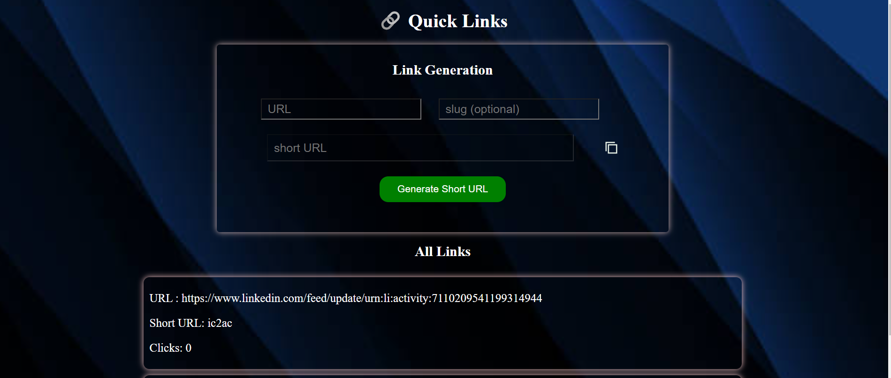

# Quick-Link

Quick-Link Generator is a web-based tool that simplifies the process of creating short and custom links for your URLs. Whether you need to share links on social media, track click statistics, or enhance user experience, Quick-Link Generator has you covered.

- I developed this project using **MERN stack**.

- This project use of url shortner **user can
easliy long link is converted into short link**
or url.Hence user can easliy understand.the
link

- Save long URLs and their corresponding
short URLs in MongoDB. When user click the
short URL, track the **click count for the
original URL.**

- It is mostly used in **client meeting in
company, teacher meeting** .

## Source Code:- 
   https://github.com/achaltelmasre/quick-links

 ## Live demo:-
     https://quick-links.onrender.com/

